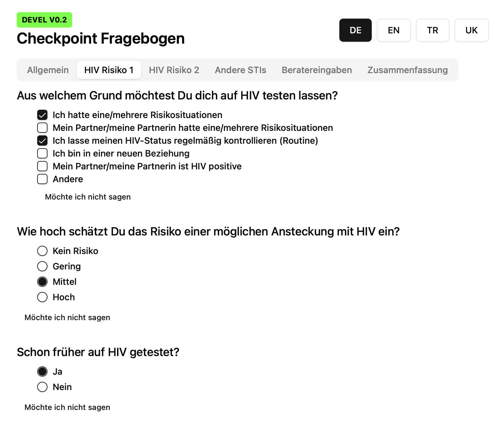

# 🩺 Checkpoint Fragebogen App

**Checkpoint Fragebogen** is a cross-platform desktop application for **anonymous STI testing intake** at Checkpoint Aids Hilfe Duisburg / Kreis Wesel. It provides a multilingual, privacy-conscious questionnaire interface for visitors and stores or transmits responses securely for counselor use.

The app is packaged as native executables for **Windows** (`.exe`) and **macOS** (`.dmg`) using **Tauri**, ensuring fast performance, and local-first security. 

**The app is currently under development — v0.2 (questionnaire logic implemented, results storage in progress).**

---

## 🛠 Tech Stack

### **Frontend**
- **React 19** – Component-based UI framework
- **TypeScript** – Strongly typed JavaScript for safer development
- **Tailwind CSS** – Utility-first CSS framework for rapid, consistent styling
- **Radix UI** – Accessible, headless UI primitives (`@radix-ui/react-*`)
- **Lucide Icons** – Open-source SVG icon set
- **class-variance-authority** / `clsx` – Utility for conditional class management
- **tailwindcss-animate** – Tailwind plugin for animations

### **Desktop Packaging**
- **Tauri** – Secure, lightweight framework to build desktop apps with web tech  
  - Targets:  
    - **Windows**: NSIS installer (`.exe`)  
    - **macOS**: `.app` & `.dmg` bundles  
  - Rust backend provided by `src-tauri/`

### **Build Tools & Development**
- **Vite 7** – Next-generation frontend tooling for fast builds and HMR
- **PostCSS** / **Autoprefixer** – CSS processing and browser compatibility
- **ESLint + TypeScript ESLint** – Linting for consistent, error-free code
- **pnpm** (via Tauri config) – Fast, disk-efficient package manager

---

## 📂 Project Structure
```
src/              # React/TypeScript source code
src-tauri/        # Tauri Rust backend & build config
components/       # Reusable UI components
assets/           # Static images/icons
index.css         # Tailwind CSS entry
tailwind.config.js# Tailwind theme/config
vite.config.ts    # Vite build configuration
package.json      # Project scripts & dependencies
```

---

## ⚙️ Build & Run

### **Development**
```bash
pnpm install
pnpm tauri dev
```
Runs the app with hot-reloading in a Tauri window.

### **Production Build**
```bash
pnpm tauri build
```
Generates `.exe` (Windows) and `.dmg` (macOS) installers.

---

## 🌍 Features
- Multilingual questionnaire (German, English, Turkish, Ukrainian)
- Anonymous data handling
- Designed for in-clinic use with counselor assistance
- Responsive UI for various screen sizes
- Secure local execution — no internet required unless configured

---

## 📄 License
This project is released under the [MIT License](LICENSE).

---

## 📷 Screenshots



